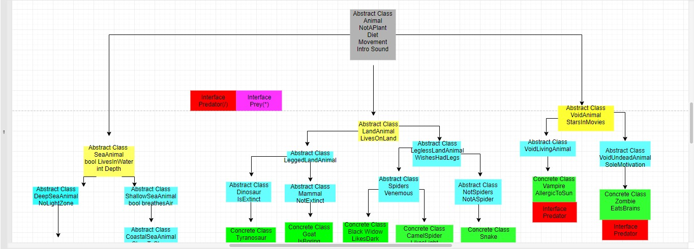
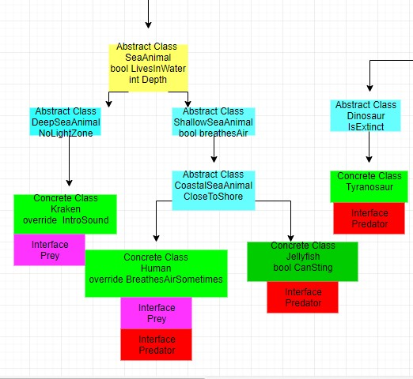
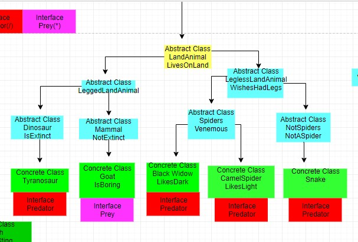

# Lab05-Zoo

## About this project
This program is a digital zoo. Using derived classes and properties, animals are created. At the highest level are abstract classes, deriving down to each subsequent type of animal. There are further abstract classes for 3 categories of animal: land, sea, and void. Each animal class has abstract subclasses, along with a mix of abstract, virtual, and concrete properties. At the end level are concrete classes which allow each type of animal to be instantiated as objects. 

## Example

## How to use
This program requires Visual Studio. Once the repo has been cloned to the user's local machine, they simply need to navigate to the solution folder, and open the solution using Visual Studio. Then, run the program.cs file. After that, follow the prompts. The test file can be opened via the test solution also located in the project directory.

## OOP Principles
1. Inheretance: Inheretence is the principle of derived properties from classes. C# does not support multiple inheretence. Each class is derived and inherets the properties of the previous class. Inheretence tells a class what it has, as opposed to interfaces, which tell a class what it can do.

2. Abstraction: Abstraction is the principle that properties and methods can be stated without definition. For example, an abstracted boolean can be inhereted until it reaches a concrete class, at which point it must be defined as true or false. Both properties and methods can be abstracted.

3. Polymorphism: Polymorphism is the ability to change behaviors and attributes of derived classes. There are 3 types: concrete, virtual, and abstract. A concrete class is what can be instantiated as an object. A virtual class is defined but can be overriden, while an abstract class is not defined and must be overriden when derived to a concrete class.

4. Encapsulation: Encapsulation modifiers control access to the code. There are 5 different types:
	1. Public: methods and properties are available to all.
	2. Private: methods and properties are only accessible through the class itself.
	3. Protected: methods and properties are only accessible through the class and derived children.
	4. Internal: Access is limited only to the assemly (.sln file).
	5. Protected Internal: Access limited to .snl and descendents (assembly).

## OOP Principles implemented in project
1. Inheretence: Each class and subclass of animal types are derived from the base class Animal. The path of the Kraken, for example, derives from Animal, down to SeaAnimals, down to DeepSeaAnimals. It inherets the properties and methods of all 3 levels above it.

2. Abstraction. All classes except the individual animals are abstract classes within this project. Additionally, each class has abstract properties, such as MethodOfMovement, which are adjusted in each derived class. Sea animals swim, while land animals walk or slither. Each animal class also has a different sound.

3. Polymophism. Polymorphism is evident throughout the project, with abstract and virtual classes being overridden in the individual animal classes.

4. Encapsulation. While the classes and interfaces are contained within different files and folders, they are able to interact with each other through public access modifiers.

## Interfaces
As stated above, interfaces tell a class what it can do. Since C# does not allow multiple inheretence, interfaces are used to "bridge the gap" between single inheretence in classes, and properties or methods that can apply to more than one class or derived class. In this project there are two, used to define the difference between predator and prey in each concrete animal class. IEatPrey is used as a boolean for animals that eat other animals. IRunFromPredators is a string, which returns the instinct response of a prey being attacked by a predator.

## Licensing
This program is available under the MIT license.